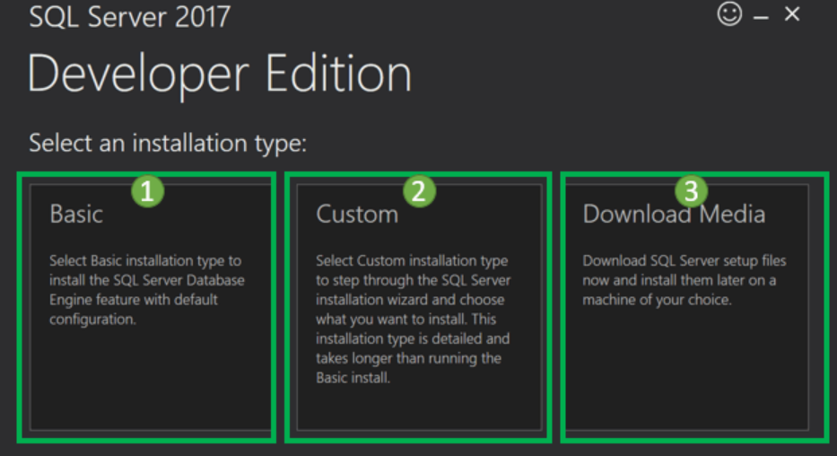
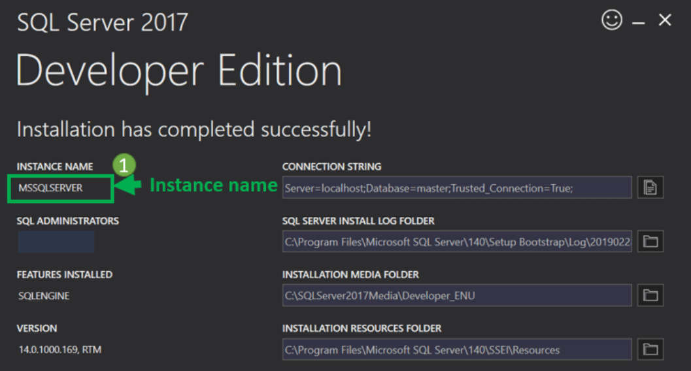
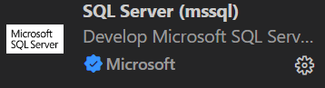
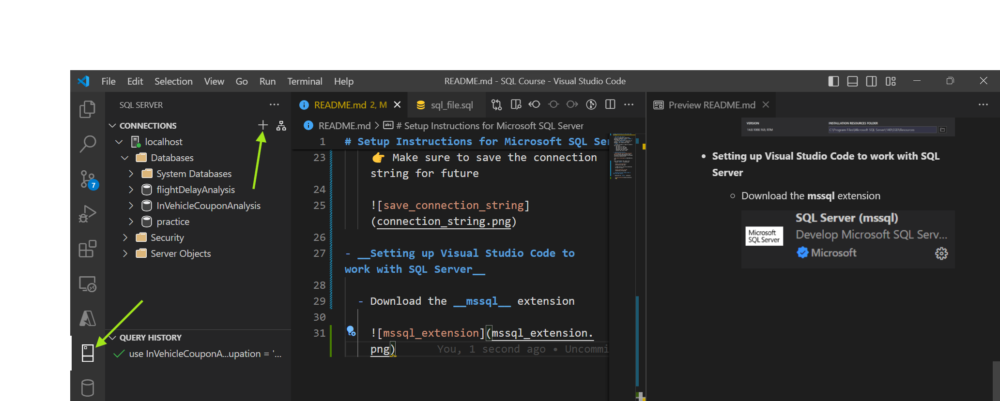
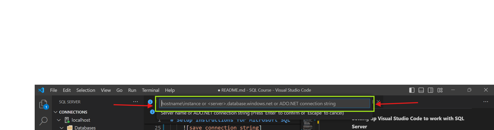

# Setup Instructions for Microsoft SQL Server

- __Microsoft SQL Server__
  - It is a proprietary relational database management system (__RDBMS__) developed by __Microsoft__.
  - It allows applications and tools to connect __SQL Server__ instance or database, and communicate using __T-SQL__.
  - It also provides a range of products and services:
    - SQL Server on Azure
    - SQL Server at the edge
    - SQL Server on-premises
    - Developer SQL Server 2022
    - Express SQL Server 2022

- __Installing SQL Server__
  - [Download SQL Server 2022 Developer Edition](https://go.microsoft.com/fwlink/p/?linkid=2215158&clcid=0x4009&culture=en-in&country=in)
  
  

  After downloading the setup file
  - Choose __Basic__ installation

    

    👉 Make sure to save the connection string for future

    

- __Setting up Visual Studio Code to work with SQL Server__

  - Download the __mssql__ extension

    
    
    Paste the connection string you've copied post installation of SQL Server
    

🚀 You've succesfully setup SQL Server and Visual Studio Code. Happy Analysis 📈
